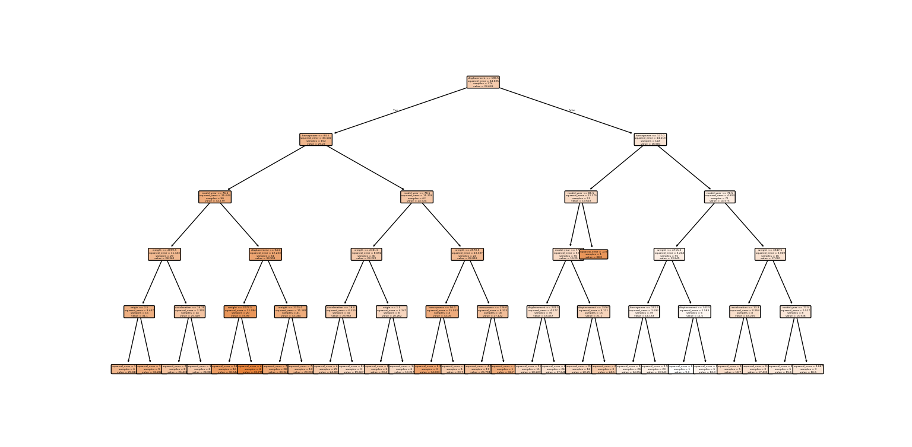
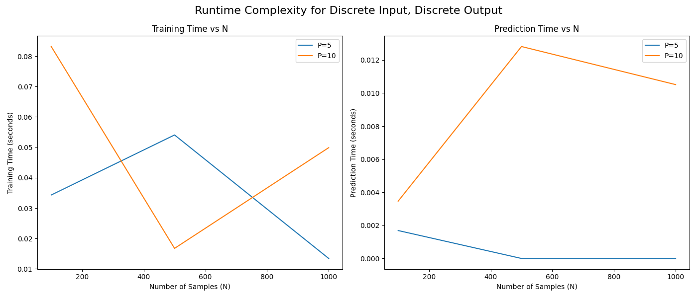
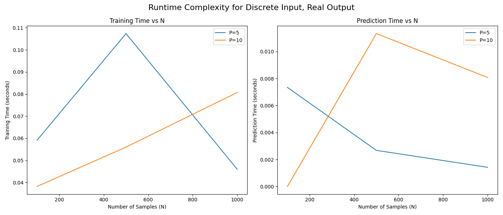
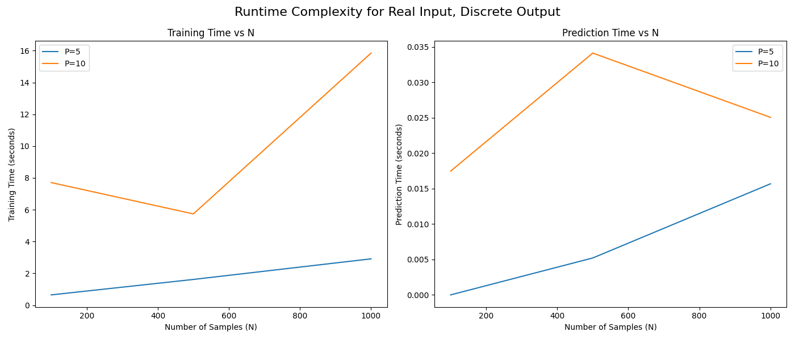
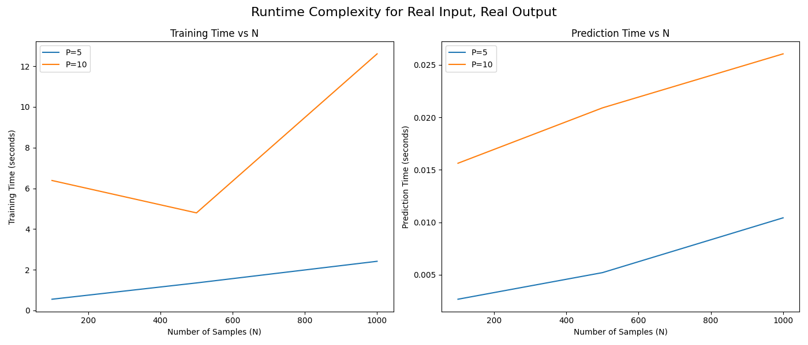

QUESTION 2:

Accuracy:  0.9666666666666667

Precision for class 1:  1.0

Recall for class 1:  0.9333333333333333

Precision for class 0:  0.9375

Recall for class 0:  1.0

Q2

Best parameters (depth):  {'max_depth': 1}

Best cross-validation score:  0.89

QUESTION 3:

Accuracy:  0.9666666666666667

Precision for class 1:  1.0

Recall for class 1:  0.9333333333333333

Precision for class 0:  0.9375

Recall for class 0:  1.0

Q2

Best parameters (depth):  {'max_depth': 1}

Best cross-validation score:  0.89

decision tree by running the code(auto-efficiency.py)

scikit-learn Decision Tree Performance:

RMSE: 3.1751205206902453

MAE: 2.2961593623269154

Q4:

